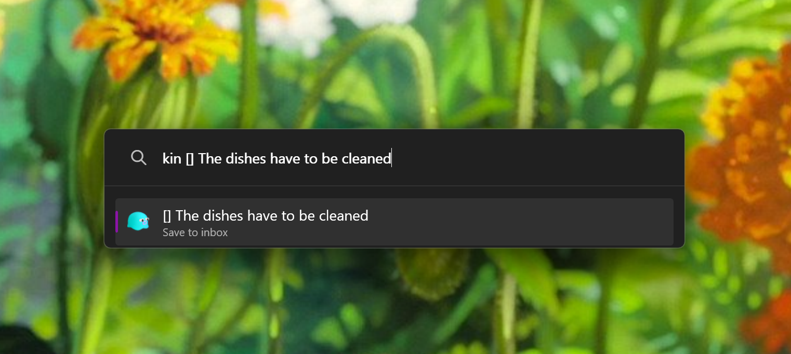
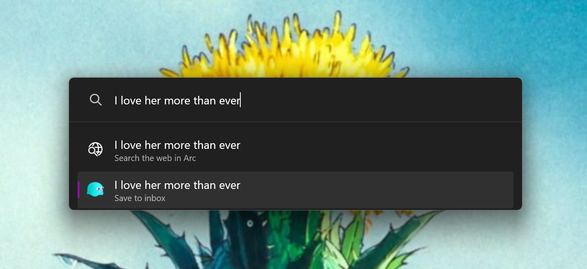

# Kinopio

PowerToys Run plugin to save cards to your Kinopio inbox - without losing context.

## Usage
Send anything you want, right to your inbox:
- Task — `kin [] Water plants before it's too late`
- Quote — `kin "Lean into the things that make you like yourself."`
- Link — `kin https://www.youtube.com/watch?v=8ho8FoV3Ee0`

### API key

This plugins uses the official [Kinopio API](https://help.kinopio.club/api/). To use it, you'll need to retrieve your Kinopio API key. Here's how to find it:
1. Login to [kinopio.club](https://kinopio.club)
2. Click in your user icon (top right)
3. Click on `Settings`
4. Click on `Account`
5. Click on `Developer Info`
6. Click on `Copy API Key` (**this is private, don't share this key with anyone)**

Now that you have the key in your clipboard, paste it into the plugin settings page.

### Change action key

The default action key to activate the plugin is `kin`, but you can change it to wathever you want, like `k` or `🐸`.

You can also enable "Include in global result", which will remove the action key requirement.

## Installation

1. Download the latest release of Kinopio plugin from the [releases page](https://github.com/mateuswolkmer/kinopio-powertoys/releases);
2. Extract the zip file's contents to your PowerToys modules directory (usually `%LOCALAPPDATA%\Microsoft\PowerToys\PowerToys Run\Plugins`);
3. Restart PowerToys.

## Development
After making your changes, run `.\Build.ps1` and extract the generated zip correspondant to your platform (ARM or x64) to your PowerToys modules directory, following step 2 from [Installation](#installation).

## Issues
If you encounter any issue, please raise it in the [issues page](https://github.com/mateuswolkmer/kinopio-powertoys/issues) or tag `@mawo` in the [Kinopio Discord community](https://discord.com/invite/h2sR45Nby8).